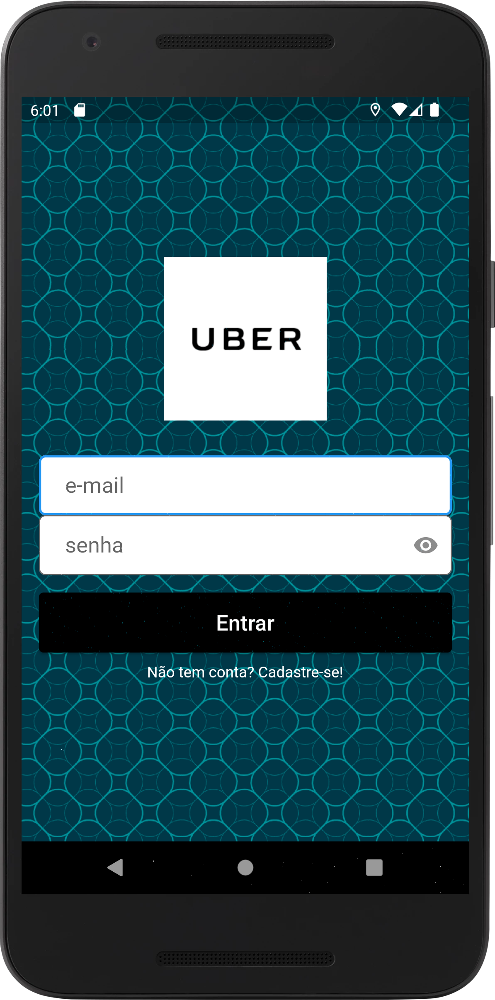
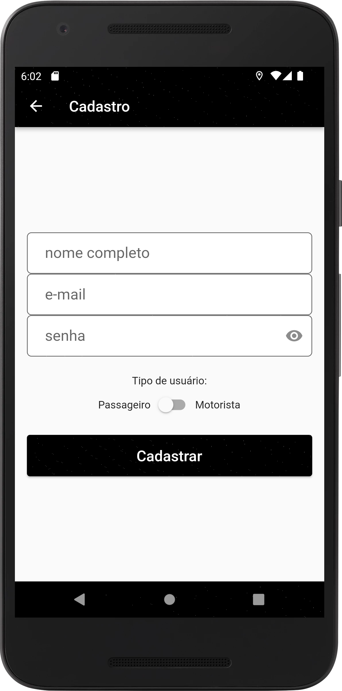
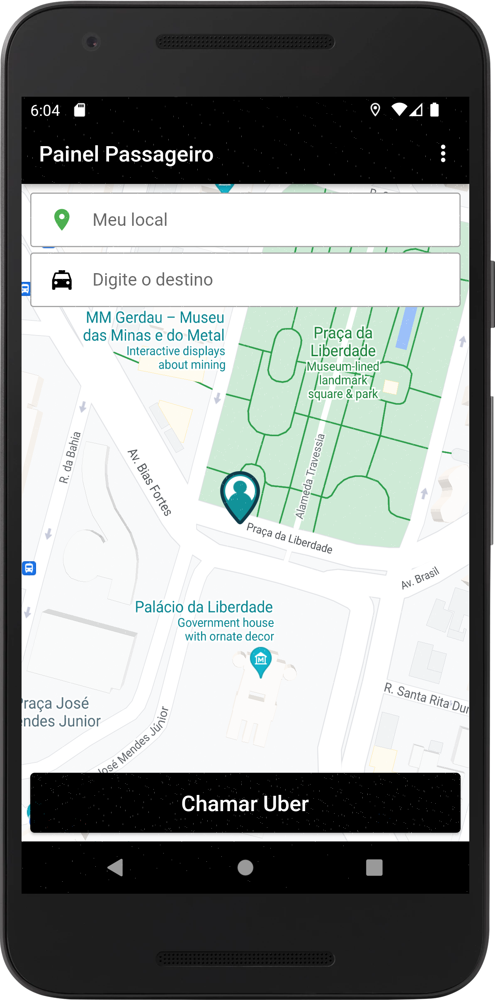
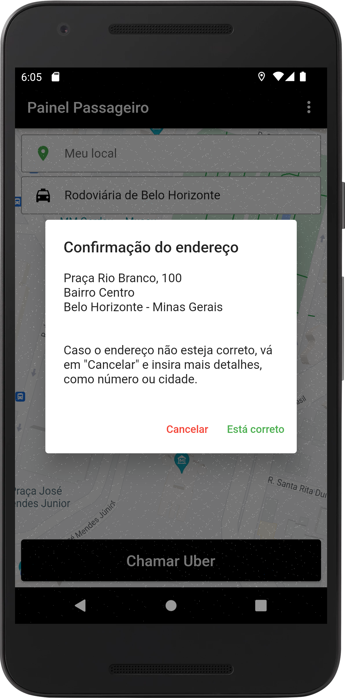
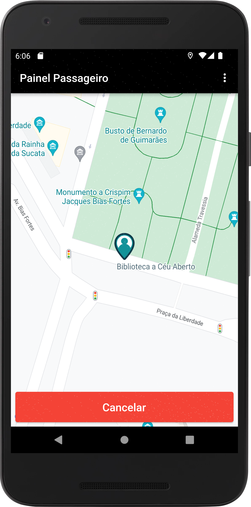
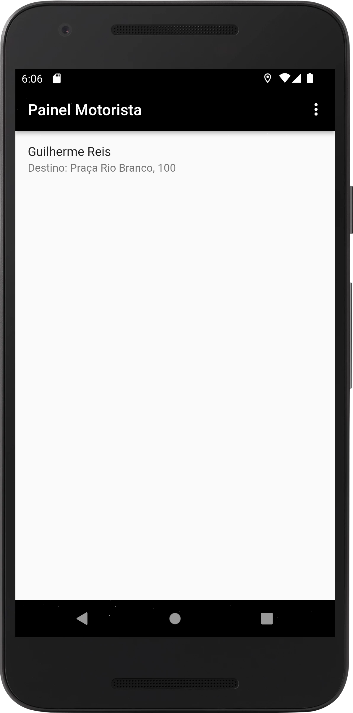
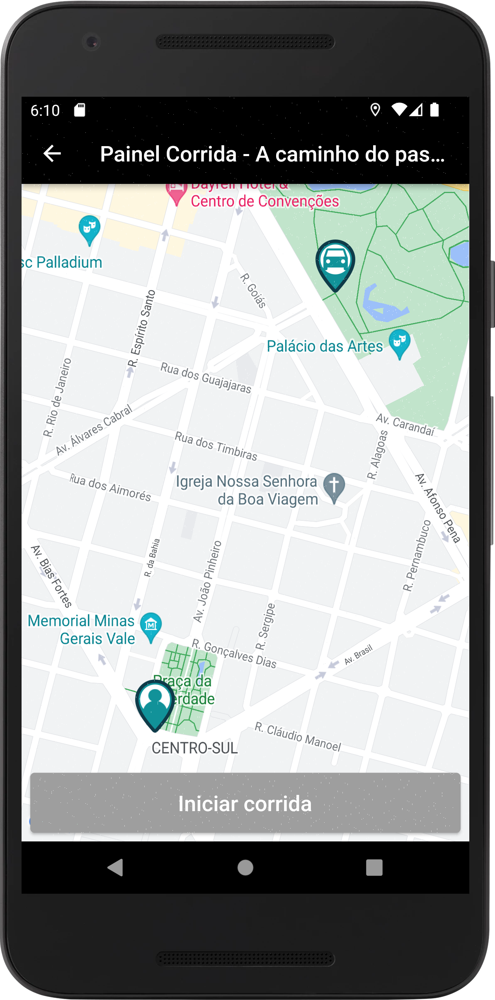
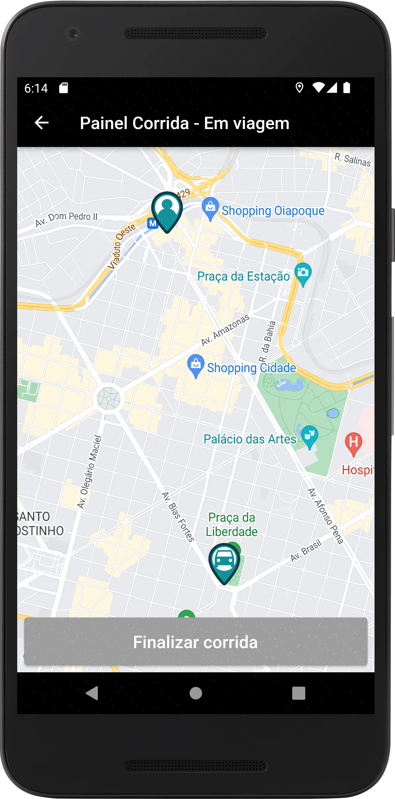
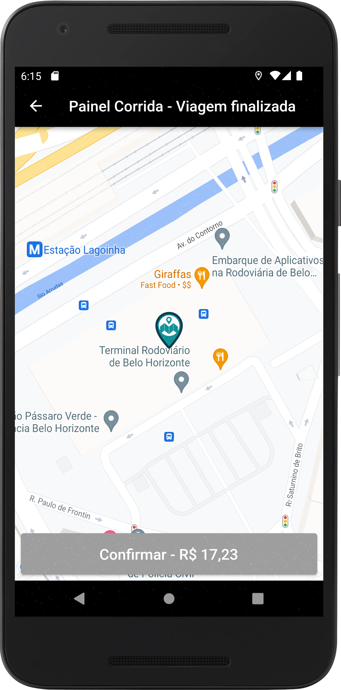

# Uber

Clone do aplicativo de mobilidade urbana Uber. Feito em Flutter.

Autor: Guilherme Reis - [LinkedIn](https://www.linkedin.com/in/guilhermereisdev/)

### Sistemas disponíveis

✅ Android | ✅ iOS

### Recursos do app

Replica algumas funcionalidades básicas do app Uber, como:

- Cadastro de passageiros e motoristas.
- Solicitação de viagens pelo passageiro, que define o endereço de destino.
- Escolha e aceitação de viagens pelos motoristas disponíveis.
- Visualização do local onde o passageiro está comparado ao local do motorista.
- Visualização do local de destino comparado ao local do passageiro.
- Atualização em tempo real das movimentações do passageiro e do motorista.
- Finalização de viagem com exibição de preço na tela.

### Técnicas utilizadas

- Google Maps for Flutter - Plugin que exibe o mapa no app no estilo Google Maps.
- Flutter Geolocator Plugin - Plugin que trabalha a geolocalização do smartphone do usuário.
- Flutter Geocoding Plugin - Plugin que transforma latitude/longitude em endereços e vice-versa.
- Firebase Auth - Usuário cria conta pelo app e o acessa usando e-mail e senha.
- Firebase Firestore - Armazena informações sobre os usuários na nuvem com acesso em tempo real.
- intl - Formatador de números para exibir os preços de acordo com as definições de país.
- Tratamento de erros (Exceptions) - Erros são tratados com exceções customizadas, exibindo
  mensagens claras e em português, para ficar claro para o usuário qual atitude tomar.

### Telas

_Clique na imagem para ver em tela cheia_

Login e criação de conta 
 

Usuário solicitando viagem 
  

Telas do motorista (Lista de viagens disponíveis, visualização do motorista até o local onde o passageiro está e visualização até o destino) 
  

Tela de cobrança após o término da viagem 
 

